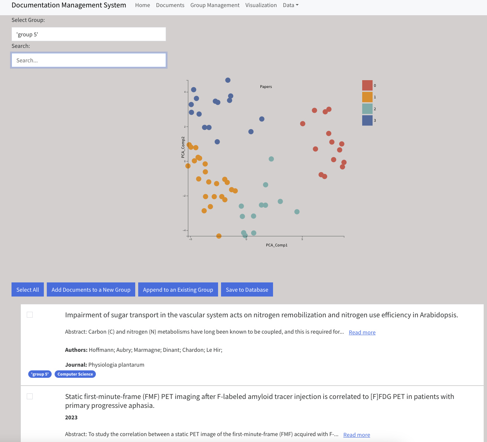

# Document Management System

The system is a react application with flask back end, that aims to cluster the documents based on their abstract and title information. Bert is used for finding the embeddings of the documents and then cosine similarity is used to generate the network connections.

The clustering is also done based on the KMeans on bert vectors.

